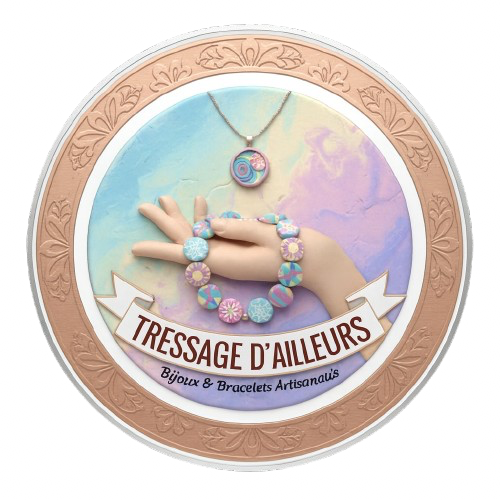

# Tressage_Ailleurs.github.io
<!DOCTYPE html>
<html lang="fr">
<head>
<meta charset="UTF-8">
<title>Tressage Ailleurs – Accueil</title>
<meta name="viewport" content="width=device-width, initial-scale=1.0">

</head>

<body>

<header>
    
    <h1>Tressage Ailleurs</h1>
    
Créations artisanales – bracelets & tressages faits main

</header>

<nav>
    <a href="index.html">Accueil</a>
    <a href="presentation.html">Présentation</a>
    <a href="articles.html">Articles</a>
    <a href="abonnements.html">Abonnements</a>
    <a href="panier.html">🛒 Panier</a>
</nav>

    

        <h2>Bienvenue</h2>
        

            Tressage Ailleurs est un espace dédié à la création artisanale.
            Chaque pièce est réalisée à la main avec soin, patience et passion.
        

    

<footer>© 2026 – Tressage Ailleurs</footer>

<a href="panier.html" class="panier-flottant">🛒 Panier</a>

</body>
</html>
